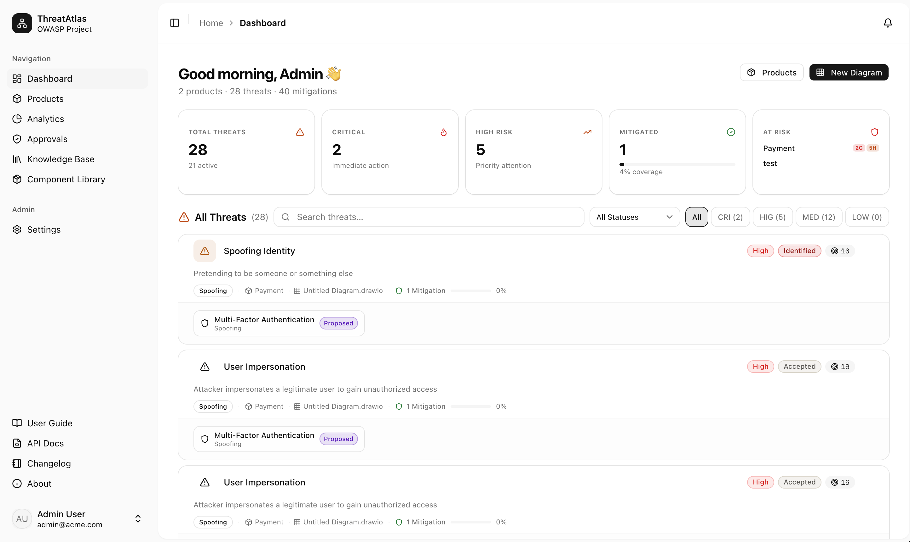

# OWASP ThreatAtlas

[](https://owasp.org/projects/)
[](LICENSE.md)
[](https://github.com/OWASP/www-project-threatatlas/pulls)

**OWASP ThreatAtlas** is an open-source web application for team-based threat modeling. Organizations run structured sessions by inviting developers, DevOps, architects, and security engineers to map systems, record threats and mitigations, and review risk in one place—instead of scattering notes across documents and slides.

The project is **Apache 2.0** licensed. The [application source](threatatlas-app/) ships as a modern stack (FastAPI, PostgreSQL, React) and is designed to be **self-hosted** so data stays under your control.

---

## Mission

Bridge the gap between security frameworks and real architectures: make it easy to **draw** data flows, **attach** threats and mitigations from recognized knowledge bases, **collaborate** with clear ownership and history, and **review** how risk changes over time.



---

## What ThreatAtlas offers

- **Data Flow Diagrams (DFDs)** — Interactive diagrams for processes, data stores, external entities, flows, and trust boundaries, with **Draw.io / .drawio import** and diagram templates for fast onboarding.
- **Component Library** — Drag pre-built security components into diagrams and use the Component Threat Library to browse, edit, and revert predefined threat/mitigation mappings per framework.
- **Threats, mitigations, and risk** — Link mitigations to threats; record likelihood, impact, and risk score; see risk-oriented views in **analytics** and heatmap overlays.
- **Knowledge base** — Browse and apply content from multiple frameworks (e.g. STRIDE, PASTA, LINDDUN, OWASP references, MITRE-oriented material, CVSS-oriented guidance—see the app and docs for the current catalog).
- **Collaboration** — Products shared with teammates, with **RBAC**, invitations, and visibility controls.
- **Real-time editing** — Live cursor tracking, real-time diagram sync, and auto-save.
- **Approvals and risk acceptance** — Formal approval workflows, justification tracking, a dedicated approvals dashboard, and notifications for reviewers and collaborators.
- **Notifications and search** — In-app bell with unread badges plus global search (⌘K / Ctrl+K) for products, diagrams, KB threats, and mitigations.
- **DevOps integration** — API Tokens for machine access, JIRA issue creation from threat cards, and a CI/CD Security Gate endpoint for pass/fail checks.
- **History** — **Diagram versioning** with comparison, including visibility into threat and mitigation changes—not only canvas edits.
- **Comments** — Discussion on threats and mitigations for async review.
- **Custom frameworks** — Define organization-specific methodology and reuse it across diagrams.
- **Enterprise authentication** — SSO providers, LDAP, and SCIM provisioning (e.g. with Keycloak), plus a TLS deployment option.
- **MCP server** — Connect AI clients to ThreatAtlas through a built-in Model Context Protocol endpoint.
- **Optional AI assistant** — When enabled by an administrator, a conversational AI assistant in the diagram editor can help explore threats and proposals; provider and keys are configured in-app (see deployment and security notes in the docs).

---

## Why OWASP ThreatAtlas?

- **Open source and self-hosted** — Inspect the code, adapt it, and run it in your environment.
- **Many frameworks, one workspace** — Diagramming, a structured threat/mitigation model, and a growing knowledge base in one place instead of separate spreadsheets and diagrams.
- **Built as a product, not a static site** — Authentication, teams, persistence, and UI workflows for day-to-day threat modeling.
- **Practical outputs** — Analytics, versioning, and diagram export support reviews and continuous refinement of a threat model.

---

## Repository layout

- **[OWASP project page (`index.md`)](index.md)** — Jekyll source for the OWASP project site (governance and overview).
- **[ThreatAtlas application (`threatatlas-app/`)](threatatlas-app/)** — Backend, frontend, Docker Compose, and tool documentation.

---

## Quick start

```bash
cd threatatlas-app
cp .env.example .env
docker compose up -d
```

The app is then available at <http://localhost:3001>. See the [Installation guide](threatatlas-app/docs/installation.md) for configuration and first-run details.

---

## Documentation

### Installation & setup

Run ThreatAtlas locally or in your infrastructure:

👉 **[Installation guide](threatatlas-app/docs/installation.md)**

### Development & contributing

Build, test, and submit changes:

👉 **[Development guide](threatatlas-app/docs/development.md)**

### User guide

Learn the main UI flows (products, diagrams, threats, mitigations, settings):

👉 **[User guide](threatatlas-app/docs/user-guide.md)**

### Integrations & deployment

- **[MCP server](threatatlas-app/docs/mcp.md)** — Connect AI clients via the Model Context Protocol.
- **[CI/CD integration](threatatlas-app/docs/ci-integration.md)** — Security Gate and API token usage in pipelines.
- **[LDAP](threatatlas-app/docs/ldap.md)** and **[SCIM with Keycloak](threatatlas-app/docs/scim-keycloak.md)** — Directory authentication and provisioning.
- **[TLS](threatatlas-app/docs/tls.md)** — Serving ThreatAtlas over HTTPS.

### Releases

What changed in each version:

👉 **[Changelog](CHANGELOG.md)**

---

## Community & contributing

ThreatAtlas is an open-source, community-first project. We welcome contributions in many forms:

- **Contributing to the code**: see the **[Development guide](threatatlas-app/docs/development.md)**.
- **Expanding the knowledge base**: help us add more service-specific threat models.
- **Join the conversation**: connect on the [OWASP Slack](https://owasp.org/slack/invite) in the `#project-threatatlas` channel.

---

## Security

To report a vulnerability, see the [Security policy](SECURITY.md).

---

## License

- The **software** is licensed under the [Apache License 2.0](LICENSE.md).
- The **documentation and content** are licensed under [Creative Commons Attribution-ShareAlike 4.0 International](https://creativecommons.org/licenses/by-sa/4.0/).

---

## Star History

<a href="https://www.star-history.com/?repos=owasp%2Fwww-project-threatatlas&type=date&legend=top-left">
 <picture>
   <source media="(prefers-color-scheme: dark)" srcset="https://api.star-history.com/chart?repos=owasp/www-project-threatatlas&type=date&theme=dark&legend=top-left" />
   <source media="(prefers-color-scheme: light)" srcset="https://api.star-history.com/chart?repos=owasp/www-project-threatatlas&type=date&legend=top-left" />
   
 </picture>
</a>

---

## Contributors

[](https://github.com/OWASP/www-project-threatatlas/graphs/contributors)